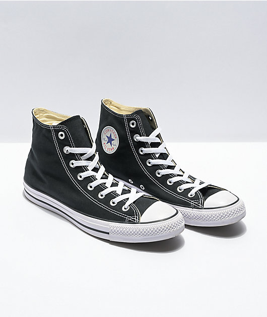
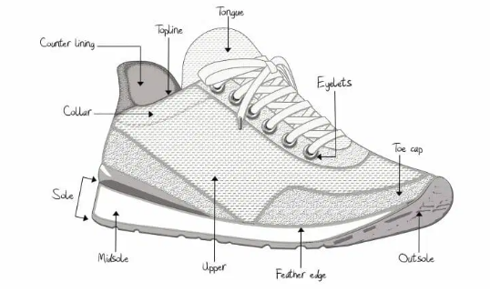

# FiYS (Find Your Shoes): Image-Text Pair Dataset 
This repo is about labeling shoes image with fine-grained description.
We're constructing Shoes Text-Image pair dataset for our capstone project.
After constructing dataset, we will release our dataset in public.

## Example
| id            | image                      | description                                                                                                                                                                                                                                               |
|---------------|----------------------------|-----------------------------------------------------------------------------------------------------------------------------------------------------------------------------------------------------------------------------------------------------------|
| 1125282207474 |  | brand is converse, shoes name is high black, upper is black with five-pointed star brand symbol in white circle, midsole is white with a black line, outsole is white, toebox is white, tongue is black, heeltap is black, top is high, shoelace is white |

## Data Filtering
 1. Image Filtering
    - Removed images less than 5KB image size.
    - Removed images with an aspect ratio greater than 3.0.
    - Removed images with min(width, height) < 200.
2. For those that do not meet the above filtering criteria, change the name of each image to unique Id
3. Enter input for label.
   ```python
       label = f'brand is {brand}, name is {name}, upper is {upper}, midsole is {midsole},' \
            f'outsole is {outsole}, toebox is {toebox}, tongue is {tongue}, heeltap is {heeltap},' \
            f'top is {top}, shoelace is {shoelace}.'
   ```
4. Save in the ID column and label column in the data frame.
5. Repeat 1 to 4.

## Label info
We referenced Shoes terminology from this [link](https://www.shoeguide.org/shoe_anatomy/).


We chose a selectively important 10 features among the various features of the shoe.
(brand, name, upper, midsole, outsole, toebox, tongue, heeltap, top, shoelace)

## Reference
1. [COYO-700M: Image-Text Pair Dataset](https://github.com/kakaobrain/coyo-dataset)
2. [WIT : Wikipedia-based Image Text Dataset](https://github.com/google-research-datasets/wit)


## Quick Start
```python
poetry install
poetry run python -m main
```
